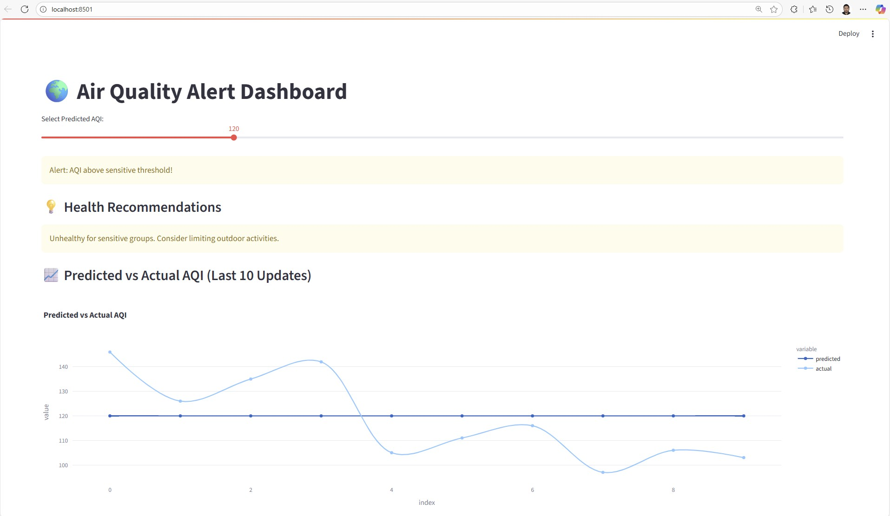
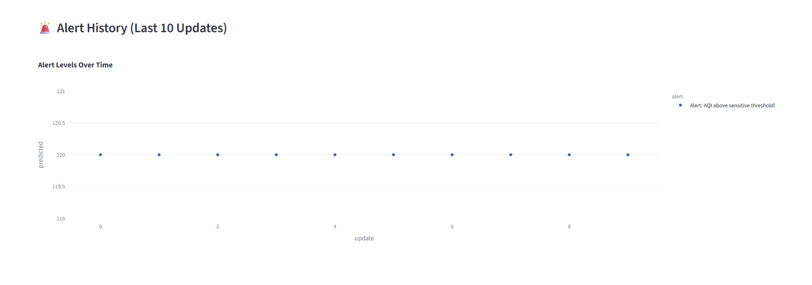
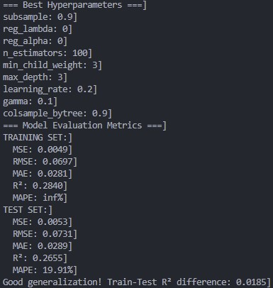
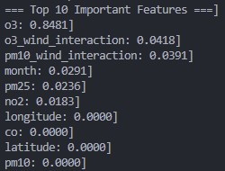

Photo by <a href="https://unsplash.com/@mrdarkcore?utm_content=creditCopyText&utm_medium=referral&utm_source=unsplash">Denis Kashentsov</a> on <a href="https://unsplash.com/photos/a-person-riding-a-bike-on-a-busy-highway-g1Tab7zqg2g?utm_content=creditCopyText&utm_medium=referral&utm_source=unsplash">Unsplash</a>
      
      
      


[](https://github.com/ellerbrock/open-source-badges/)

Badge [source](https://shields.io/)

# Air-Quality-Health-Alert-System

In this project, we are developing a Streamlit Dashboard that alerts the residents in the USA about air quality health risks. This is an end-to-end Machine learning portfolio project that involves Model Development and Model training. The Machine Learning Project is implemented with MLOps and CI/CD pipelines. MLOps consists of Data Ingestion, Data Validation, Data Transformation, Model Trainer, Model Evaluation, Alert Generation, and Dashboard. The Streamlit app is deployed on the Streamlit website.

## Authors

- [Samith Chimminiyan](https://www.github.com/samithcsachi)

## Table of Contents

- [Authors](#Authors)
- [Table of Contents](#table-of-contents)
- [Problem Statement](#problem-statement)
- [Tech Stack](#tech-stack)
- [Data source](#data-source)
- [Quick glance at the results](#Quick-glance-at-the-results)
- [Lessons learned and recommendation](#lessons-learned-and-recommendations)
- [Limitation and what can be improved](#limitations-and-what-can-be-improved)
- [Work Flows](#workflows)
- [Run Locally](#run-locally)
- [Explore the notebook](#explore-the-notebook)
- [Contribution](#contribution)
- [License](#license)

## Problem Statement 

Air pollution remains a major global health concern, with millions of people exposed daily to harmful levels of pollutants. High Air Quality Index (AQI) values are directly linked to respiratory diseases, cardiovascular problems, and overall health deterioration. However, the general public often finds it difficult to interpret AQI numbers and understand their health implications, which reduces the effectiveness of air quality monitoring systems.

Traditional air quality dashboards typically provide raw AQI values without actionable context, real-time monitoring, or health-oriented alerts. This creates a gap between environmental data and informed personal decision-making.

The Air Quality Health Alert Dashboard addresses this gap by simulating air quality data, predicting AQI trends, and generating real-time health alerts and recommendations. Instead of relying on external APIs, the system uses a synthetic dataset and interactive features (e.g., sliders) to simulate AQI inputs and compare predicted vs. actual values. The dashboard provides:

- Visual comparison of predicted and actual AQI values.

- Dynamic alerts based on AQI thresholds.

- Health recommendations tailored to different AQI levels.

- Historical trend tracking for the last 10 updates.

This solution not only demonstrates how AQI prediction and health alert systems can be built end-to-end but also serves as an educational tool to raise awareness of the health risks associated with poor air quality.

## Tech Stack

- pandas
- mlflow
- notebook
- numpy
- scikit-learn
- xgboost
- seaborn
- matplotlib
- python-box
- pyYAML
-joblib
- types-pyYAML
- streamlit
- streamlit-autorefresh
- plotly


## Data source

Data Source Link : - [https://www.kaggle.com/datasets/samithsachidanandan/air-quality-data-2019-2025](https://www.kaggle.com/datasets/samithsachidanandan/air-quality-data-2019-2025)

This is a synthetic dataset generated using the Python library Faker. This dataset includes the air quality data of all states of the USA from 2019 -2025.

Attribute Information

1. Date: The calendar date when the measurement was recorded.

2. City: The name of the city or location where the data was collected.

3. Latitude: The geographical latitude coordinate of the measurement location.

4. Longitude: The geographical longitude coordinate of the measurement location.

5. pm25: Particulate matter smaller than 2.5 micrometers in diameter (µg/m³), a key measure of air pollution.

6. pm10: Particulate matter smaller than 10 micrometers in diameter (µg/m³).

7. o3: Ozone concentration (µg/m³ or ppb depending on dataset standards).

8. no2: Nitrogen dioxide concentration (µg/m³ or ppb).

9. so2: Sulfur dioxide concentration (µg/m³ or ppb).

10. co: Carbon monoxide concentration (mg/m³ or ppm depending on units used).

11. aqi: Air Quality Index, a standardized score derived from pollutant levels to reflect overall air quality.

12. AQI_Category: The qualitative air quality level (e.g., Good, Moderate, Unhealthy for Sensitive Groups, Unhealthy, Very Unhealthy, Hazardous).

13. temperature_c: Ambient temperature in degrees Celsius.

14. humidity_percent: Relative humidity expressed as a percentage.

15. wind_speed_mps: Wind speed in meters per second.


## Quick glance at the results

Main Welcome Screen of the Website







## Lessons learned and recommendations

- Learned how to implement advanced feature engineering, including lag features, date transformations, etc.

- Implemented feature scaling techniques that can be reused for other projects.

- Learned techniques to handle outliers

- Learned how to use RandomizedSearchCV for hyperparameter tuning.

- Used XGBoost to make the predictions.


Our air quality prediction model is working stably and gives consistent results across training and test data. The most important factor influencing predictions is ozone, followed by wind effects, seasonality, and fine particles like PM2.5. While the model captures some trends, it currently explains only about a quarter of the variability in air quality, meaning there’s still room for improvement. To make it more accurate, we need to add better features, especially weather interactions and time-related patterns, and refine how we handle cases with zero pollution values.

The model is stable and consistent, but currently it explains only about 25–28% of air quality variation. Its predictions are “okay” (about 20% error on average), but it underestimates extreme pollution events.

## Limitations and what can be improved

- Limited Predictive Power:
The model explains only about 25–28% of the variation in air quality index (AQI), meaning it misses many factors influencing air pollution changes.

- Weak Handling of Complex Patterns:
The current model (XGBoost) struggles to fully capture the relationships in pollution data.

- Feature Limitations:
Important meteorological factors like temperature, humidity etc underutilized. 

- Static Dataset (Not API):
Using a synthetic dataset reduces the ability to make real-time or near-real-time predictions and limits responsiveness to sudden pollution events.

- Limited Range of Prediction:
The model predicts only a narrow AQI range, underestimating extremely high or low pollution levels critical for health alerts.

- MAPE Issues :
MAPE issues need to be handled more efficiently 

- Dashboard-Based Alerting without Real-Time Updates:
Without an API integrating live data updates, the alert system may have latency—alerts rely on batch updates, not continuous streaming data.

Below are the things that can be done to improve the model. 
- Adding more features. 
- Use more advanced modeling techniques. 
- Use real-time API data source


## Workflows

1. Update config.yaml
2. Update schema.yaml
3. Update params.yaml
4. Update entity
5. Update the configuration manager in src config
6. Update the components 
7. Update teh pipeline
8. Update the main.py
9. Update the dashboard.py


## Run Locally

Initialize git

```bash
git init
```

Clone the project

```bash
git clone https://github.com/samithcsachi/Air-Quality-Health-Alert-System.git
```

Open Anaconda Prompt and Change the Directory and Open VSCODE by typing code .

```bash
cd E:/Air-Quality-Health-Alert-System

```

Create a virtual environment 

```bash
python -m venv venv

```

```bash
.\venv\Scripts\activate   
```


install the requirements

```bash
pip install -r requirements.txt
```


```bash

python main.py

```

Run the streamlit app 

```bash

streamlit run dashboard.py

```


## Explore the notebook

GitHub :  [https://github.com/samithcsachi/Air-Quality-Health-Alert-System](https://github.com/samithcsachi/Air-Quality-Health-Alert-System)

## Contribution

Pull requests are welcome! For major changes, please open an issue first to discuss what you would like to change or contribute.

## License

MIT License

Copyright (c) 2025 Samith Chimminiyan

Permission is hereby granted, free of charge, to any person obtaining a copy
of this software and associated documentation files (the "Software"), to deal
in the Software without restriction, including without limitation the rights
to use, copy, modify, merge, publish, distribute, sublicense, and/or sell
copies of the Software, and to permit persons to whom the Software is
furnished to do so, subject to the following conditions:

The above copyright notice and this permission notice shall be included in all
copies or substantial portions of the Software.

THE SOFTWARE IS PROVIDED "AS IS", WITHOUT WARRANTY OF ANY KIND, EXPRESS OR
IMPLIED, INCLUDING BUT NOT LIMITED TO THE WARRANTIES OF MERCHANTABILITY,
FITNESS FOR A PARTICULAR PURPOSE AND NONINFRINGEMENT. IN NO EVENT SHALL THE
AUTHORS OR COPYRIGHT HOLDERS BE LIABLE FOR ANY CLAIM, DAMAGES OR OTHER
LIABILITY, WHETHER IN AN ACTION OF CONTRACT, TORT OR OTHERWISE, ARISING FROM,
OUT OF OR IN CONNECTION WITH THE SOFTWARE OR THE USE OR OTHER DEALINGS IN THE
SOFTWARE.

Learn more about [MIT](https://choosealicense.com/licenses/mit/) license

## Contact
If you have any questions, suggestions, or collaborations in data science, feel free to reach out:
- 📧 Email: [samith.sachi@gmail.com](mailto:samith.sachi@gmail.com)
- 🔗 LinkedIn: [www.linkedin.com/in/samithchimminiyan](https://www.linkedin.com/in/samithchimminiyan)
- 🌐 Website: [www.samithcsachi.github.io](https://samithcsachi.github.io/)

